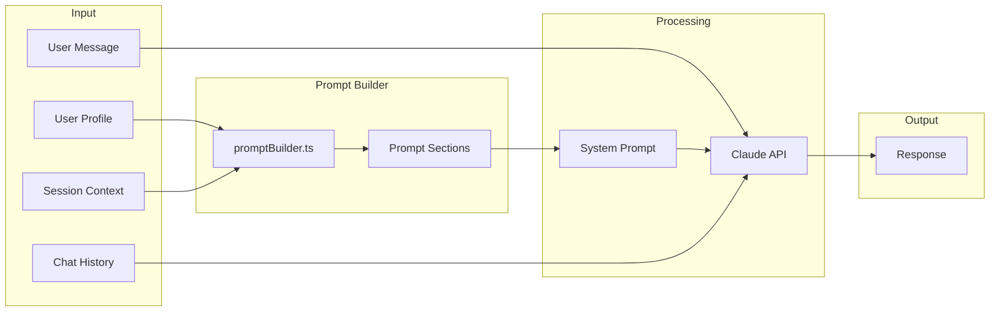

# yeww AI System

This document describes how the AI assistant works, including the prompting strategy, context management, and personality guidelines.

---

## Overview

yeww uses **Claude (claude-sonnet-4)** via the Anthropic API as its AI backbone. The key differentiator is that Claude has access to the user's complete health profile, enabling personalized conversations that no generic chatbot can provide.

The system uses a **modular prompt architecture** with XML-structured sections, inspired by professional conversation design and health AI best practices.



---

## Architecture

### File Structure

```
src/
├── app/api/chat/
│   └── route.ts              # API endpoint, uses promptBuilder
├── lib/
│   ├── promptBuilder.ts      # Main prompt construction
│   └── promptSections/       # Modular prompt sections
│       ├── index.ts          # Barrel export
│       ├── identity.ts       # Who yeww is
│       ├── healthKnowledge.ts # Health metric interpretation
│       ├── conversation.ts   # Conversation design patterns
│       ├── voice.ts          # Language and tone
│       ├── safety.ts         # Medical boundaries, crisis
│       ├── patterns.ts       # Pattern surfacing guidelines
│       ├── formatting.ts     # Response formatting
│       └── examples.ts       # Few-shot examples
└── types/
    └── index.ts              # PromptContext, SessionContext types
```

### System Prompt Structure (~5,000 tokens)

The prompt uses XML tags for clear organization:

```xml
<system>
  <identity>           Who yeww is and isn't
  <core_mission>       Three value propositions
  <user_context>       Enhanced profile with interpretations
  <health_knowledge>   How to interpret HRV, sleep, recovery
  <current_health_data> Dynamic metrics if available
  <conversation_design> Three-step rhythm, sentiment awareness
  <session_context>    Time of day, conversation turn
  <voice_personality>  Language patterns, do's/don'ts
  <safety_boundaries>  Medical limits, crisis detection
  <pattern_surfacing>  When/how to share insights
  <detected_patterns>  Active patterns if available
  <formatting>         Response structure
  <examples>           Few-shot demonstrations
</system>
```

---

## The Chat Endpoint

**Location:** `src/app/api/chat/route.ts`

### Request Format

```typescript
interface ChatRequest {
  messages: Message[];
  userProfile: {
    name: string;
    coachingStyle: CoachingStyle;
    healthAreas: { name: string }[];
    createdAt: string;
    healthScore: number;
    reputationLevel: ReputationLevel;
    points: number;
    priorities: Priority[];
    pastAttempt: PastAttempt | null;
    barriers: Barrier[];
    dataSources: DataSource[];
    checkInStreak: number;
    lastCheckIn?: string | null;
  };
}
```

### Response Format

```typescript
interface ChatResponse {
  message: string;
}
```

---

## Prompt Sections

### 1. Identity & Mission

Defines who yeww is—a health-obsessed friend who knows the research—and what it isn't (not a doctor, therapist, or replacement for professional care).

Three core value propositions:
1. **Unified Health Picture** - Synthesize fragmented data into insights
2. **Personalized Guidance** - What works for THIS person
3. **Long-term Companion** - Build trust over time

### 2. User Context

Enhanced profile section including:
- Basic info (name, membership duration, scores)
- Preferences (coaching style, priorities, tracking)
- History & barriers (with interpretive context)
- Coaching style-specific instructions

### 3. Health Knowledge

Teaches Claude how to interpret metrics:

**HRV:**
- Personal baseline matters more than absolute numbers
- Trend over weeks more meaningful than single readings
- What affects it negatively/positively

**Sleep:**
- Stages matter (light, deep, REM)
- Consistency often more impactful than total hours
- Quality indicators

**Recovery/RHR:**
- RHR trending up = early warning sign
- Recovery scores guide intensity, not binary go/no-go

### 4. Conversation Design

**Core rhythm:** Acknowledge → Confirm → Guide

**Sentiment awareness:**
- Struggling users get empathy before solutions
- Positive users get matched energy
- Neutral gets light touch

**Question style:**
- "Worth trying?" not "You should..."
- Open, empowering questions
- Avoid prescriptive language

### 5. Voice Personality

**Tone:** Health-obsessed friend who texts casually but knows their stuff

**Use:**
- "I noticed...", "Worth trying?", "Heads up..."
- "That's rough", "Good stuff", "Nice."

**Avoid:**
- Medical jargon ("parasympathetic activity")
- Corporate enthusiasm ("Amazing!")
- Excessive emojis, exclamation marks

### 6. Safety Boundaries

**Medical:**
- Never diagnose or recommend medications
- Redirect persistent/concerning symptoms to doctors
- Take all symptoms seriously

**Crisis detection:**
- Self-harm mentions, hopelessness get immediate care
- Provide crisis resources (988, Crisis Text Line)
- Express care without panic

**Sensitive topics:**
- Weight: Focus on feelings, not numbers
- Eating: Flag potential disordered patterns
- Exercise: Watch for overtraining signs

### 7. Pattern Surfacing

**When to share:**
- Relevant to current context
- Actionable
- High enough confidence

**How to share:**
- "I noticed [pattern] when [condition]. [Impact]."
- Conversational, not clinical
- Don't overwhelm with data

### 8. Examples

Six few-shot examples demonstrating:
1. Morning check-in with sleep data
2. Returning user (no guilt)
3. Pattern surfacing before workout
4. Celebrating streaks
5. Redirecting medical questions
6. Encouraging data connection
7. Handling pushback
8. Supporting venting

---

## Session Context

Dynamic context passed to each conversation:

```typescript
interface SessionContext {
  timeOfDay: 'morning' | 'afternoon' | 'evening' | 'night';
  dayOfWeek: string;
  isFirstMessageToday: boolean;
  lastCheckInDaysAgo: number | null;
  conversationTurn: number;
}
```

Used to:
- Tailor greetings to time of day
- Welcome returning users without guilt
- Adjust depth based on conversation stage

---

## Coaching Styles

### Direct
- Straightforward feedback, no sugarcoating
- "You've been under 6 hours sleep for 4 nights. That's hurting your recovery."

### Supportive
- Lead with empathy, celebrate wins
- "I know sleep's been tough. Even 20 minutes earlier could help."

### Balanced
- Adapts to situation
- Direct for important issues, supportive for check-ins

---

## Token Budget

| Section | Tokens |
|---------|--------|
| Identity + Mission | ~200 |
| User Context | ~400 |
| Health Knowledge | ~1,500 |
| Conversation Guidelines | ~600 |
| Voice Personality | ~400 |
| Safety Boundaries | ~500 |
| Pattern Surfacing | ~300 |
| Formatting | ~200 |
| Examples | ~600 |
| Dynamic Context | ~300 |
| **Total** | **~5,000** |

Well within context limits, leaves room for conversation history.

---

## API Configuration

```typescript
const response = await anthropic.messages.create({
  model: 'claude-sonnet-4-20250514',
  max_tokens: 1024,
  system: systemPrompt,
  messages: formattedMessages,
});
```

| Parameter | Value | Rationale |
|-----------|-------|-----------|
| Model | claude-sonnet-4 | Good balance of quality and cost |
| Max tokens | 1024 | Keeps responses concise |
| Temperature | default (1.0) | Natural conversational variation |

---

## Future Enhancements

### Short Term
- [ ] Include real health data from Terra integration
- [ ] Pass detected patterns to prompt context
- [ ] Add conversation memory beyond current session

### Medium Term
- [ ] Proactive check-ins based on health state
- [ ] Multi-turn goal tracking
- [ ] Integration with wearable alerts

### Long Term
- [ ] Voice interface
- [ ] Personalized daily briefings
- [ ] Predictive health warnings

---

## Testing Conversations

When testing, cover these scenarios:

1. **Morning check-in** - Simple greeting, sleep data discussion
2. **Struggling user** - Verify empathy-first response
3. **Pattern opportunity** - Check natural insight surfacing
4. **Medical redirect** - Confirm appropriate boundaries
5. **Different styles** - Test direct vs supportive responses
6. **Crisis detection** - Verify safety response

---

*See also: [SCORING.md](./SCORING.md) for how health/reputation scores work*
