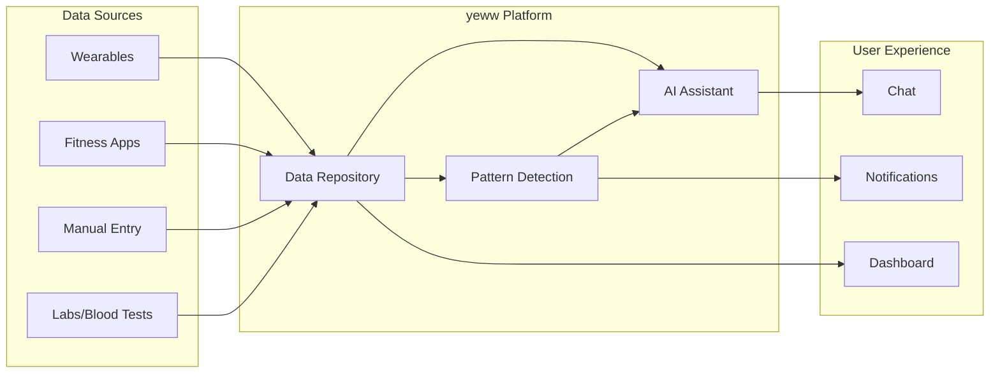
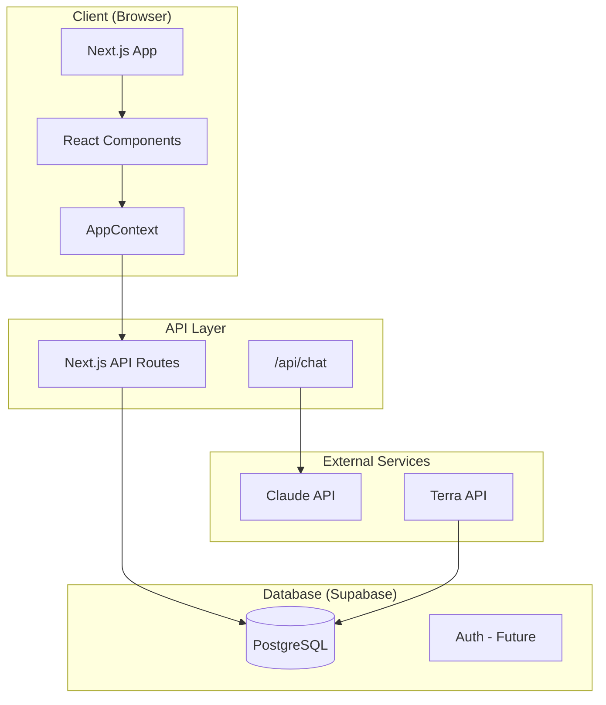
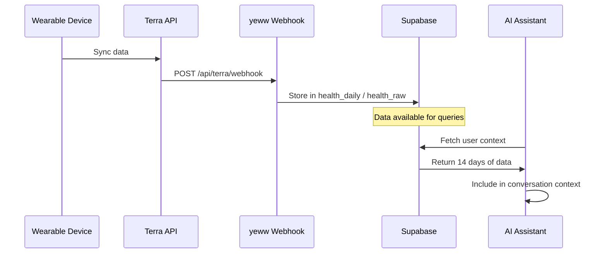
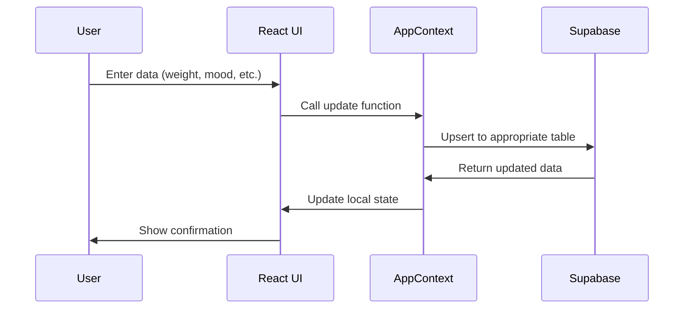
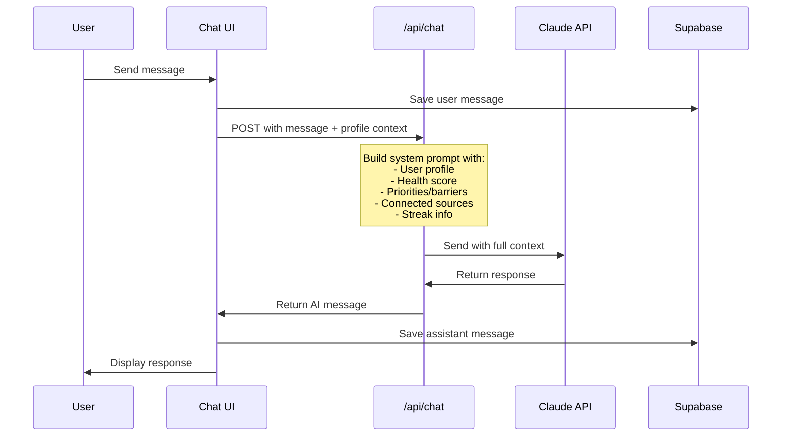
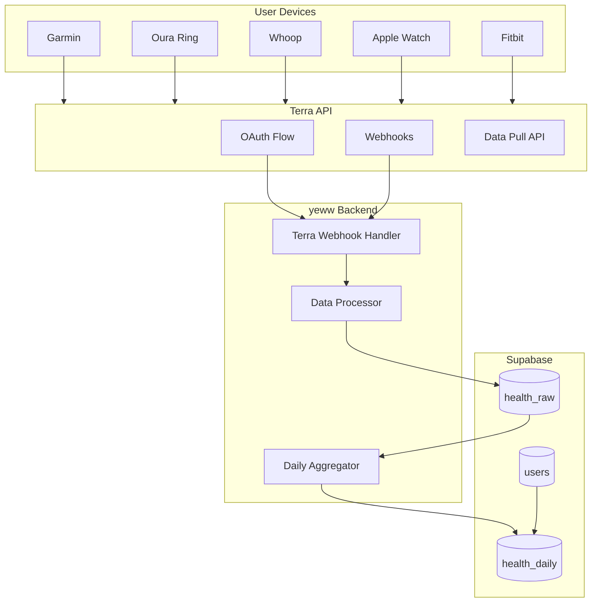

# yeww Architecture

This document describes the system architecture at three levels: high-level overview, technical architecture, and data flow.

---

## 1. High-Level Overview

How data flows from sources to insights:



**The core idea:** All health data flows into a single repository. The AI assistant has full access to this data, enabling personalized conversations and pattern detection that no single-source app can provide.

---

## 2. Technical Architecture

The system components and how they connect:



### Components

| Component | Technology | Purpose |
|-----------|------------|---------|
| **Frontend** | Next.js 16 (App Router) | Server-rendered React app |
| **State Management** | React Context (AppContext) | Client-side state + data fetching |
| **Database** | Supabase (PostgreSQL) | Persistent storage for all user data |
| **AI** | Claude API (claude-sonnet-4) | Conversational AI with full context |
| **Wearable Data** | Terra API (planned) | Unified API for Garmin, Oura, Whoop, etc. |
| **Hosting** | Vercel | Deployment and edge functions |

### Key Files

```
src/
├── app/
│   ├── api/chat/route.ts    # AI chat endpoint
│   ├── chat/page.tsx        # Chat UI
│   ├── home/page.tsx        # Dashboard
│   ├── onboarding/page.tsx  # 16-screen onboarding flow
│   └── ...
├── components/
│   ├── scores/              # Health score, reputation, points UI
│   └── ui/                  # Reusable UI components
├── contexts/
│   └── AppContext.tsx       # Global state + Supabase integration
├── lib/
│   ├── storage.ts           # Data access layer (Supabase queries)
│   ├── supabase.ts          # Supabase client
│   └── scores.ts            # Scoring calculations
└── types/
    └── index.ts             # TypeScript types
```

---

## 3. Data Flow

How a data point moves through the system:

### 3a. Wearable Data (via Terra - planned)



### 3b. Manual Entry (current)



### 3c. Chat Conversation



---

## 4. Future Architecture (with Terra)

When Terra is integrated:



### Terra Integration Points

1. **OAuth Flow**: User connects device via Terra's widget
2. **Webhook**: Terra sends data when device syncs
3. **Data Processing**: Normalize different device formats
4. **Daily Aggregation**: Roll up raw data into daily summaries

---

## 5. Security Considerations

### Current State
- Supabase RLS disabled for development
- User ID stored in localStorage
- No authentication yet

### Planned (with Auth)
- Supabase Auth for user accounts
- Row Level Security (RLS) on all tables
- User can only access their own data
- Secure API routes with auth middleware

---

## 6. Scaling Considerations

### Current (MVP)
- Single Supabase project
- Serverless functions via Vercel
- Suitable for hundreds of users

### Future
- Consider read replicas for heavy analytics
- Background jobs for pattern detection
- Caching layer for frequently accessed data
- Rate limiting on AI calls

---

*See also: [DATA_MODEL.md](./DATA_MODEL.md) for database schema details*
