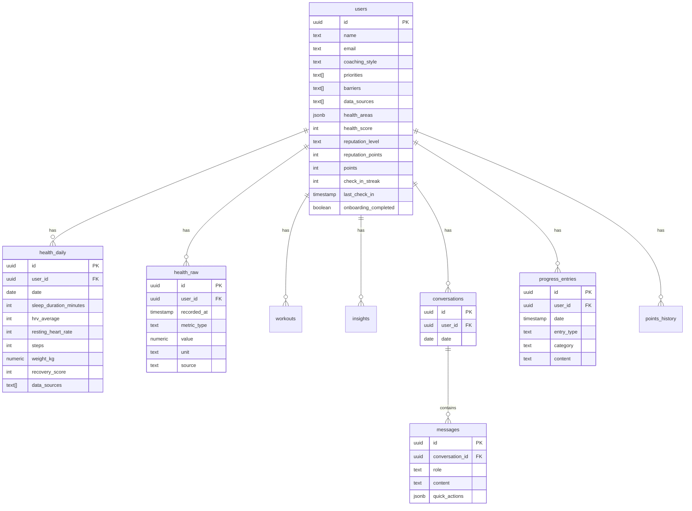

# yeww Data Model

This document describes the database schema, data types, and how data flows through the system.

---

## Overview

yeww uses **Supabase (PostgreSQL)** as its database. The schema is designed around these principles:

1. **Single source of truth** - All health data in one place
2. **Raw + aggregated** - Keep granular data (90 days) and daily summaries (forever)
3. **Flexible** - Support multiple data sources and types
4. **Patterns** - Store discovered insights for quick access

---

## Entity Relationship Diagram



---

## Tables

### `users`
Core user profile and settings.

| Column | Type | Description |
|--------|------|-------------|
| `id` | uuid | Primary key |
| `name` | text | User's name |
| `email` | text | Email (unique, nullable) |
| `coaching_style` | text | `direct`, `supportive`, or `balanced` |
| `priorities` | text[] | Health priorities (e.g., `sleep-better`, `more-energy`) |
| `past_attempt` | text | Previous health journey attempts |
| `barriers` | text[] | What gets in the way (e.g., `life-busy`, `lose-motivation`) |
| `data_sources` | text[] | Connected data sources |
| `connected_apps` | text[] | Legacy: connected apps |
| `health_areas` | jsonb | Health areas being tracked |
| `health_score` | int | Current health score (0-100) |
| `reputation_level` | text | `starter`, `regular`, `trusted`, `verified`, `expert` |
| `reputation_points` | int | Points toward reputation |
| `points` | int | Gamification points |
| `check_in_streak` | int | Consecutive days checked in |
| `last_check_in` | timestamp | Last check-in time |
| `sharing_research` | boolean | Consent for research sharing |
| `sharing_brands` | boolean | Consent for brand offers |
| `sharing_insurance` | boolean | Consent for insurance sharing |
| `ai_data_access` | boolean | AI can access all data |
| `terra_user_id` | text | Terra API user ID (future) |
| `onboarding_completed` | boolean | Finished onboarding flow |

### `health_daily`
One row per user per day. Kept forever.

| Column | Type | Description |
|--------|------|-------------|
| `id` | uuid | Primary key |
| `user_id` | uuid | Foreign key to users |
| `date` | date | The day this data represents |
| `sleep_duration_minutes` | int | Total sleep time |
| `sleep_quality_score` | int | 0-100 sleep quality |
| `sleep_deep_minutes` | int | Deep sleep duration |
| `sleep_rem_minutes` | int | REM sleep duration |
| `hrv_average` | int | Average HRV (ms) |
| `resting_heart_rate` | int | RHR (bpm) |
| `steps` | int | Total steps |
| `active_calories` | int | Calories burned from activity |
| `weight_kg` | numeric(5,2) | Body weight |
| `body_fat_percent` | numeric(4,1) | Body fat percentage |
| `recovery_score` | int | 0-100 recovery |
| `strain_score` | numeric(3,1) | Strain/load score |
| `data_sources` | text[] | Which devices contributed data |

**Unique constraint:** `(user_id, date)`

### `health_raw`
Granular data points. Kept 90 days.

| Column | Type | Description |
|--------|------|-------------|
| `id` | uuid | Primary key |
| `user_id` | uuid | Foreign key to users |
| `recorded_at` | timestamp | When the data was recorded |
| `metric_type` | text | Type: `heart_rate`, `hrv`, `steps`, `sleep_stage`, etc. |
| `value` | numeric | The measured value |
| `unit` | text | Unit of measurement |
| `metadata` | jsonb | Additional context |
| `source` | text | `garmin`, `oura`, `apple_health`, etc. |

**Indexes:**
- `(user_id, recorded_at DESC)` - Time-based queries
- `(user_id, metric_type, recorded_at DESC)` - Metric-specific queries

### `workouts`
Individual workout sessions.

| Column | Type | Description |
|--------|------|-------------|
| `id` | uuid | Primary key |
| `user_id` | uuid | Foreign key to users |
| `started_at` | timestamp | Workout start time |
| `ended_at` | timestamp | Workout end time |
| `workout_type` | text | `running`, `cycling`, `strength`, etc. |
| `duration_minutes` | int | Total duration |
| `calories` | int | Calories burned |
| `distance_meters` | int | Distance covered |
| `avg_heart_rate` | int | Average HR during workout |
| `max_heart_rate` | int | Max HR during workout |
| `source` | text | Data source |
| `external_id` | text | ID from source system |

### `conversations`
Chat sessions grouped by day.

| Column | Type | Description |
|--------|------|-------------|
| `id` | uuid | Primary key |
| `user_id` | uuid | Foreign key to users |
| `date` | date | Conversation date |

**Unique constraint:** `(user_id, date)`

### `messages`
Individual messages within conversations.

| Column | Type | Description |
|--------|------|-------------|
| `id` | uuid | Primary key |
| `conversation_id` | uuid | Foreign key to conversations |
| `role` | text | `user` or `assistant` |
| `content` | text | Message text |
| `quick_actions` | jsonb | Suggested action buttons |
| `health_context` | jsonb | Snapshot of health data at message time |

### `insights`
AI-detected patterns. Kept forever.

| Column | Type | Description |
|--------|------|-------------|
| `id` | uuid | Primary key |
| `user_id` | uuid | Foreign key to users |
| `category` | text | `sleep`, `recovery`, `activity`, `correlation` |
| `title` | text | Short description |
| `description` | text | Full explanation |
| `confidence` | numeric(3,2) | 0.00 to 1.00 confidence score |
| `occurrences` | int | How many times observed |
| `is_active` | boolean | Still relevant |
| `dismissed_at` | timestamp | When user dismissed |
| `related_metrics` | text[] | Metrics involved |
| `metadata` | jsonb | Additional data |

### `progress_entries`
Milestones, photos, notes.

| Column | Type | Description |
|--------|------|-------------|
| `id` | uuid | Primary key |
| `user_id` | uuid | Foreign key to users |
| `date` | timestamp | Entry date |
| `entry_type` | text | `photo`, `milestone`, `note` |
| `category` | text | `body`, `skin`, `general` |
| `content` | text | The entry content |
| `note` | text | Optional note |

### `points_history`
Track points earned.

| Column | Type | Description |
|--------|------|-------------|
| `id` | uuid | Primary key |
| `user_id` | uuid | Foreign key to users |
| `type` | text | `check-in`, `log-data`, `streak-bonus`, etc. |
| `amount` | int | Points earned |
| `description` | text | What the points were for |

---

## Data Retention

| Data Type | Retention | Rationale |
|-----------|-----------|-----------|
| Raw data (`health_raw`) | 90 days | Granular data is large; patterns extracted to daily |
| Daily summaries (`health_daily`) | Forever | Needed for long-term trends and patterns |
| Insights (`insights`) | Forever | Core value of the product |
| Conversations (`messages`) | Forever | Context for AI continuity |
| User profile (`users`) | Forever | Core user data |

---

## Data Sources

### Supported Input Methods

| Method | Example | Verification Level |
|--------|---------|-------------------|
| **Auto-sync** | Garmin → Terra → yeww | Highest |
| **Manual verified** | Weight with photo | High |
| **Manual entry** | Log a meal | Medium |
| **Screenshot import** | Blood test photo | Low |
| **Conversation** | "I slept badly" | Minimal |

### Wearable Sources (via Terra)
- Garmin
- Oura
- Whoop
- Fitbit
- Apple Watch
- Google Fit

### Manual Entry Types
- Weight / body measurements
- Nutrition / meals
- Blood tests / labs
- Mood / energy
- Symptoms
- Substances (alcohol, caffeine)

---

## TypeScript Types

The frontend uses these types (from `src/types/index.ts`):

```typescript
interface UserProfile {
  id: string;
  name: string;
  createdAt: string;
  coachingStyle: 'direct' | 'supportive' | 'balanced';
  connectedApps: ConnectedApp[];
  healthAreas: HealthArea[];
  onboardingCompleted: boolean;
  lastCheckIn: string | null;
  checkInStreak: number;
  dataSources: DataSource[];
  priorities: Priority[];
  pastAttempt: PastAttempt | null;
  barriers: Barrier[];
  healthScore: number;
  reputationLevel: ReputationLevel;
  reputationPoints: number;
  points: number;
  pointsHistory: PointsTransaction[];
  sharingPreferences: SharingPreferences;
}

type DataSource =
  | 'apple-health' | 'google-fit' | 'oura' | 'whoop'
  | 'garmin' | 'fitbit' | 'myfitnesspal' | 'strava'
  | 'photos' | 'notes' | 'medical-records'
  | 'spreadsheets' | 'memory' | 'other';

type Priority =
  | 'sleep-better' | 'more-energy' | 'lose-weight'
  | 'build-muscle' | 'reduce-stress' | 'improve-focus'
  | 'live-longer' | 'understand-body' | 'be-consistent'
  | 'feel-better';

type Barrier =
  | 'life-busy' | 'lose-motivation' | 'no-results-fast'
  | 'advice-generic' | 'forget-to-track' | 'feels-like-chore'
  | 'not-sure-what-works';

type ReputationLevel =
  | 'starter' | 'regular' | 'trusted' | 'verified' | 'expert';
```

---

## Migrations

Schema is managed via SQL files:
- `supabase-schema.sql` - Full schema (for fresh installs)
- `supabase-migration.sql` - Incremental changes

To apply changes to an existing database, use the migration file or write ALTER statements.

---

*See also: [ARCHITECTURE.md](./ARCHITECTURE.md) for system architecture*
