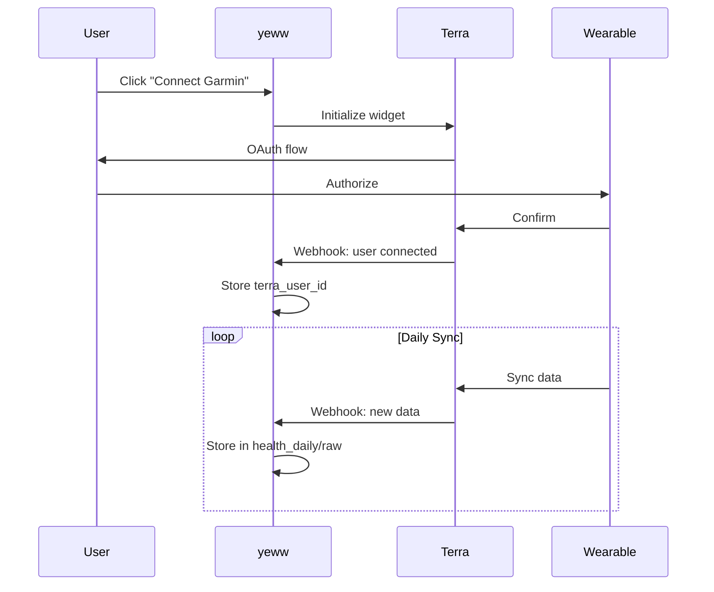

# yeww Roadmap

This document tracks the development phases, what's been completed, and what's next.

---

## Current Status

```
Phase 1: Foundation     ████████████████████ 100% ✓
Phase 2: Data Layer     ████████░░░░░░░░░░░░  40% ← Current
Phase 3: Data Expansion ░░░░░░░░░░░░░░░░░░░░   0%
Phase 4: Intelligence   ░░░░░░░░░░░░░░░░░░░░   0%
Phase 5: Advanced       ░░░░░░░░░░░░░░░░░░░░   0%
```

---

## Phase 1: Foundation ✓

**Goal:** Basic app with onboarding, AI chat, and gamification.

| Feature | Status | Notes |
|---------|--------|-------|
| Next.js 16 setup | ✓ | App Router, TypeScript, Tailwind |
| Onboarding flow | ✓ | 16 screens |
| User profile storage | ✓ | Originally localStorage, now Supabase |
| AI chat | ✓ | Claude integration with profile context |
| Health Score (v1) | ✓ | Engagement-based calculation |
| Reputation system | ✓ | 5 levels, points-based |
| Points/streaks | ✓ | Gamification layer |
| Basic UI | ✓ | Home, Chat, Health, Profile tabs |

---

## Phase 2: Data Layer (Current)

**Goal:** Real database, wearable connections, actual health data flowing.

| Feature | Status | Notes |
|---------|--------|-------|
| Supabase integration | ✓ | PostgreSQL database |
| Schema design | ✓ | Users, health_daily, messages, etc. |
| Data migration | ✓ | localStorage → Supabase |
| Terra API setup | 🔲 | **Next up** |
| OAuth flow for devices | 🔲 | Connect Garmin, Oura, etc. |
| Webhook handlers | 🔲 | Receive data from Terra |
| Health Score v2 | 🔲 | Based on actual physiological data |
| Weight tracking | 🔲 | Manual entry UI |
| Body measurements | 🔲 | Manual entry UI |

### Terra Integration Plan



---

## Phase 3: Data Expansion

**Goal:** More data sources, richer input methods.

| Feature | Status | Notes |
|---------|--------|-------|
| Nutrition logging | 🔲 | Quick log + AI estimation |
| Blood test entry | 🔲 | Manual entry form |
| Screenshot import | 🔲 | AI extracts values from images |
| App connections | 🔲 | Strava, Strong, etc. |
| Substance tracking | 🔲 | Alcohol, caffeine, supplements |
| Mood/energy logging | 🔲 | Daily check-in improvements |

### Data Entry UI Mockups

**Weight Entry:**
```
┌─────────────────────────────┐
│  Log Weight                 │
│  ┌─────────────────────┐    │
│  │      78.5 kg        │    │
│  └─────────────────────┘    │
│  ○ Morning (fasted)         │
│  ○ Evening                  │
│  Trend: ↓ 0.6kg this week   │
│         [ Save ]            │
└─────────────────────────────┘
```

**Blood Test Entry:**
```
┌─────────────────────────────┐
│  Add Blood Test             │
│  Total Cholesterol          │
│  [ 185 ] mg/dL    ✓ Normal  │
│  LDL                        │
│  [ 110 ] mg/dL    ⚠ Border  │
│  [ 📷 Screenshot import ]   │
└─────────────────────────────┘
```

---

## Phase 4: Intelligence

**Goal:** Pattern detection, predictions, proactive interventions.

| Feature | Status | Notes |
|---------|--------|-------|
| Pattern detection engine | 🔲 | Find correlations in user data |
| Pattern surfacing in chat | 🔲 | AI mentions relevant patterns |
| Proactive notifications | 🔲 | Alert when patterns trigger |
| Daily forecast | 🔲 | "Here's what to expect today" |
| Intervention suggestions | 🔲 | "Try this 60-second reset" |
| Lens + Forecast UI | 🔲 | Score → Why → Data layers |

### Pattern Detection Examples

```
Detected patterns for user:

1. Sleep × Caffeine (confidence: 0.85)
   "Coffee after 2pm → 23% worse sleep quality"
   Occurrences: 12

2. Strain × Illness (confidence: 0.72)
   "3+ days high strain + <7hr sleep → sick within 5 days"
   Occurrences: 3

3. Protein × HRV (confidence: 0.68)
   "150g+ protein days → 8% higher HRV next morning"
   Occurrences: 8
```

---

## Phase 5: Advanced

**Goal:** Cutting-edge health intelligence.

| Feature | Status | Notes |
|---------|--------|-------|
| CGM integration | 🔲 | Levels, Dexcom |
| Medication tracking | 🔲 | What you're taking |
| Genetics integration | 🔲 | 23andMe, Ancestry |
| Lapse prediction | 🔲 | Predict willpower/motivation dips |
| Illness prediction | 🔲 | Early warning from HRV/respiratory |
| Biological age | 🔲 | Calculate from biomarkers |

---

## Technical Debt & Improvements

| Item | Priority | Notes |
|------|----------|-------|
| Add Supabase Auth | High | Replace localStorage user ID |
| Enable RLS | High | Security: users only see own data |
| Error handling | Medium | Better error states in UI |
| Loading states | Medium | Skeleton loaders |
| Offline support | Low | Service worker, sync when online |
| Tests | Low | Unit tests for scoring, integration tests |

---

## Key Decisions Made

| Decision | Choice | Rationale |
|----------|--------|-----------|
| Database | Supabase | Free tier, Postgres, good Next.js integration |
| AI Model | Claude Sonnet 4 | Balance of quality and cost |
| Wearable API | Terra | 100+ devices, handles OAuth complexity |
| Styling | Tailwind CSS | Rapid development, consistent design |
| State | React Context | Simple, sufficient for current scale |

---

## Milestones

| Milestone | Target | Status |
|-----------|--------|--------|
| MVP with AI chat | Jan 2026 | ✓ |
| Supabase migration | Jan 2026 | ✓ |
| First wearable connected | TBD | 🔲 |
| Pattern detection live | TBD | 🔲 |
| 100 users | TBD | 🔲 |
| App Store launch | TBD | 🔲 |

---

*Last updated: January 2026*
