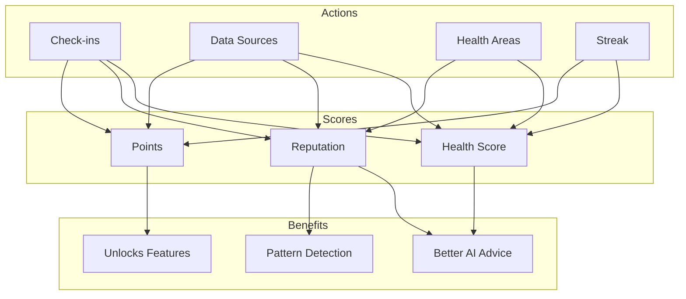

# yeww Scoring Systems

This document describes the three scoring systems in yeww: Health Score, Reputation, and Points.

---

## Overview

yeww uses three interconnected scores:

| Score | Purpose | Range | Updates |
|-------|---------|-------|---------|
| **Health Score** | Daily physiological state | 0-100 | Recalculated on data change |
| **Reputation** | Trust/data quality level | 0-100 points → 5 levels | Grows over time |
| **Points** | Gamification/engagement | 0-∞ | Earned through actions |



---

## 1. Health Score (0-100)

### Purpose
A single number representing your overall health engagement TODAY. Higher score = more complete health picture = better AI insights.

### Current Formula (v1 - Engagement-based)

```
Health Score =
  (Wearable Data × 40%) +
  (Self-Reported × 30%) +
  (Consistency × 20%) +
  (Coverage × 10%)
```

#### Component Breakdown

**Wearable Data (40%)**
```typescript
const connectedWearables = dataSources.filter(s =>
  ['apple-health', 'google-fit', 'oura', 'whoop', 'garmin', 'fitbit'].includes(s)
);
// Max out at 3 wearables
const wearableScore = Math.min(100, (connectedWearables.length / 3) * 100);
```

**Self-Reported (30%)**
```typescript
const baseScore = onboardingCompleted ? 20 : 0;
const checkInBonus = Math.min(80, checkInStreak * 10);
const selfReportedScore = baseScore + checkInBonus;
```

**Consistency (20%)**
```typescript
// Max out at 20 day streak
const consistencyScore = Math.min(100, (checkInStreak / 20) * 100);
```

**Coverage (10%)**
```typescript
// Max out at 5 health areas
const coverageScore = Math.min(100, (healthAreas.length / 5) * 100);
```

### Score Interpretation

| Score | Label | Color | Meaning |
|-------|-------|-------|---------|
| 80-100 | Excellent | `#22C55E` (bright green) | Comprehensive data, great engagement |
| 60-79 | Good | `#4ADE80` (green) | Solid data coverage |
| 40-59 | Fair | `#FACC15` (yellow) | Room to improve coverage |
| 0-39 | Getting Started | `#EF4444` (red) | Just beginning |

### Future Formula (v2 - Physiology-based)

When wearable data is flowing via Terra:

```
Health Score =
  (Sleep Score × 30%) +
  (Recovery Score × 30%) +
  (Activity Score × 20%) +
  (Consistency × 10%) +
  (Trends × 10%)

Where:
- Sleep Score = Duration + efficiency + deep sleep %
- Recovery Score = HRV vs personal baseline + RHR trend
- Activity Score = Movement goals + workout load balance
- Consistency = Check-in streak
- Trends = Week-over-week improvement/decline
```

---

## 2. Reputation Score

### Purpose
Trust level based on data quality and consistency. Higher reputation = more personalized AI insights and access to advanced features.

### Levels

| Level | Threshold | Description |
|-------|-----------|-------------|
| Starter | 0 | Just getting started |
| Regular | 50 | Consistent engagement |
| Trusted | 150 | Reliable data contributor |
| Verified | 300 | High-quality, verified data |
| Expert | 500 | Long-term, comprehensive data |

### Points Calculation

```
Reputation Points =
  Consistency (max 30) +
  Verification (max 25) +
  Completeness (max 20) +
  History (max 15) +
  Cross-validation (max 10)

Total possible: 100 points
```

#### Component Breakdown

**Consistency (max 30 points)**
```typescript
// 1 point per day of check-in streak, max 30
const consistencyPoints = Math.min(30, checkInStreak);
```

**Verification (max 25 points)**
```typescript
// 5 points per connected data source, max 25
const verificationPoints = Math.min(25, dataSources.length * 5);
```

**Completeness (max 20 points)**
```typescript
let completenessPoints = 0;
if (name) completenessPoints += 4;
if (priorities.length > 0) completenessPoints += 4;
if (coachingStyle) completenessPoints += 4;
if (healthAreas.length > 0) completenessPoints += 4;
if (dataSources.length > 0) completenessPoints += 4;
```

**History (max 15 points)**
```typescript
// 1 point per week on platform, max 15
const daysSinceCreation = Math.floor((now - createdAt) / (1000 * 60 * 60 * 24));
const historyPoints = Math.min(15, Math.floor(daysSinceCreation / 7));
```

**Cross-validation (max 10 points)**
```typescript
// 2 points per health area tracked, max 10
const crossValidationPoints = Math.min(10, healthAreas.length * 2);
```

### Why Reputation Matters

1. **AI Quality** - Higher reputation = AI has more confidence in patterns
2. **Pattern Detection** - Need verified data to find reliable correlations
3. **Future Features** - Data sharing rewards, community features

---

## 3. Points System

### Purpose
Gamification to encourage consistent engagement. Points are cumulative and never decrease.

### Earning Points

| Action | Points | Notes |
|--------|--------|-------|
| Daily check-in | +10 | Once per day |
| Log data | +5 | Weight, meal, etc. |
| Hit a goal | +20 | When implemented |
| Streak bonus | +5/day | After day 3 |
| Connect data source | +50 | Per source |
| Complete onboarding | +100 | One-time |

### Streak Bonus

```typescript
function calculateStreakBonus(streak: number): number {
  if (streak <= 3) return 0;
  return (streak - 3) * 5;  // 5 points per day after day 3
}
```

Example streak rewards:
- Day 1-3: No bonus
- Day 4: +5 points
- Day 7: +20 points
- Day 14: +55 points
- Day 30: +135 points

### Points History

All point transactions are logged:

```typescript
interface PointsTransaction {
  id: string;
  type: 'check-in' | 'log-data' | 'hit-goal' | 'streak-bonus' | 'connect-source' | 'complete-onboarding';
  amount: number;
  description: string;
  timestamp: string;
}
```

---

## Implementation

### Key File
`src/lib/scores.ts`

### Exports

```typescript
// Health Score
export function calculateHealthScore(profile: UserProfile): number;
export function getHealthScoreColor(score: number): string;
export function getHealthScoreLabel(score: number): string;

// Reputation
export function calculateReputationPoints(profile: UserProfile): number;
export function calculateReputationLevel(points: number): ReputationLevel;
export function getNextReputationLevel(current: ReputationLevel): ReputationLevel | null;
export function getPointsToNextLevel(points: number, level: ReputationLevel): number;

// Points
export const POINTS_CONFIG: { CHECK_IN: 10, LOG_DATA: 5, ... };
export function calculateStreakBonus(streak: number): number;
```

### UI Components

- `src/components/scores/HealthScoreGauge.tsx` - Circular gauge display
- `src/components/scores/ReputationBadge.tsx` - Level badge
- `src/components/scores/PointsDisplay.tsx` - Points counter

---

## Future Enhancements

### Health Score v2
- [ ] Base on actual physiological data (HRV, sleep, etc.)
- [ ] Personal baselines (compare to YOUR normal, not population)
- [ ] Time-of-day adjustments

### Reputation
- [ ] Verification badges for connected sources
- [ ] Data quality indicators
- [ ] Community trust features

### Points
- [ ] Achievements/badges
- [ ] Leaderboards (opt-in)
- [ ] Rewards marketplace

---

*See also: [AI_SYSTEM.md](./AI_SYSTEM.md) for how scores influence AI behavior*
